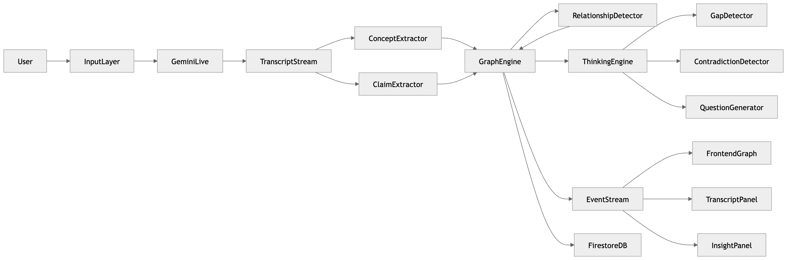

# Architecture

## System Overview

Cognitive Radar is designed with three independent layers for horizontal scalability:

1. Streaming Input Layer
2. Graph Intelligence Layer
3. Visualization Layer

## Architecture Diagram

## Components

### Backend

- FastAPI application
- Gemini AI integration for LLM processing
- Firestore for graph storage
- WebSocket for real-time streaming

### Frontend

- Next.js application
- D3.js for graph visualization
- WebSocket client for real-time updates
- Responsive panel-based layout

### Data Flow

1. User input (audio/video/text) enters the system
2. Input is processed through Gemini Live API
3. Concept and claim extraction via LLM
4. Graph engine builds knowledge graph
5. Thinking engine analyzes for gaps and contradictions
6. Events stream to frontend via WebSocket
7. Real-time visualization updates

## Scalability

The stateless microservices architecture allows:
- Independent scaling of each layer
- Millions of concurrent sessions
- Distributed processing of claims and relationships
