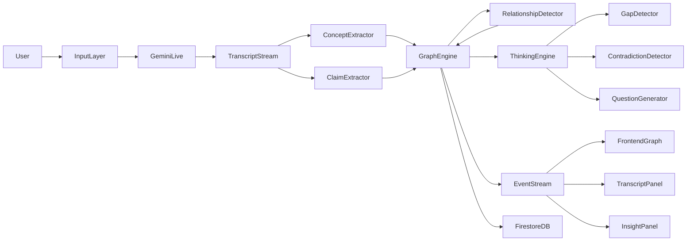

# PRODUCT REQUIREMENTS DOCUMENT

# Cognitive Map Builder

### “See the structure of thinking.”

**Tagline**

> Watch ideas form. Detect contradictions. Reveal missing assumptions.

---

# 1. Vision

Most conversations today produce **linear artifacts**:

* transcripts
* summaries
* notes

But **human understanding is non-linear**.

Ideas connect as networks of:

* concepts
* claims
* assumptions
* dependencies
* contradictions

Cognitive Map Builder converts conversations into **real-time knowledge graphs**, enabling users to **see how ideas connect and evolve**.

---

# 2. Core Innovation

The system is not just a visualizer.

It includes a **Thinking Engine**.

This engine actively analyzes conversations and identifies:

* logical gaps
* hidden assumptions
* contradictions
* weak arguments
* missing evidence

The system therefore reveals **not only what people say but what they forgot to think about**.

---

# 3. Problem Statement

Understanding complex discussions is difficult.

Examples:

### Students

Lectures contain many concepts that are hard to connect.

### Researchers

Research discussions contain assumptions that go unnoticed.

### Strategy teams

Decisions rely on implicit reasoning structures.

### Debate analysis

Arguments contain contradictions and logical gaps.

Current tools fail because they are:

* text-based
* linear
* passive

They do not help users understand **relationships between ideas**.

---

# 4. Solution

Cognitive Map Builder creates a **live cognitive graph of discussions**.

As people speak:

1. Concepts are extracted
2. Claims are identified
3. Relationships are detected
4. The graph evolves dynamically
5. The Thinking Engine highlights gaps and contradictions

The result is a **living knowledge structure**.

---

# 5. Key Capabilities

### Real-time concept extraction

Detects key entities and topics.

### Claim extraction

Identifies statements that assert something.

### Relationship detection

Detects logical relationships between claims.

Examples:

supports
contradicts
depends_on
example_of

### Assumption detection

Identifies hidden premises behind claims.

### Gap detection

Highlights missing links in reasoning.

### Contradiction detection

Identifies conflicting statements.

### Question generation

Suggests clarifying questions to deepen understanding.

---

# 6. Inputs Supported

The system supports multiple modalities.

### Audio

* meetings
* lectures
* podcasts
* interviews
* debates

Pipeline:

speech → transcript → claim extraction

---

### Video

* YouTube
* lecture recordings
* debates

Pipeline:

audio + frames → graph

---

### Text

* articles
* blogs
* PDFs
* research papers

Pipeline:

text → claim extraction → graph

---

### Screenshare

* presentations
* lecture slides

Pipeline:

slides + speech → concept detection

---

### Future extension

Camera-based whiteboard detection.

---

# 7. Product Interfaces

## Web application

Main dashboard for live graph visualization.

---

## Chrome extension

Enables graph generation directly from:

* YouTube videos
* Medium articles
* documentation pages

The extension sends transcripts or page text to backend processing.

---

# 8. User Experience

User opens Cognitive Map Builder.

Starts a conversation or loads a video.

Nodes begin appearing in the center graph.

Edges connect related ideas.

Contradictions glow red.

Missing assumptions appear as yellow nodes.

The graph grows as the conversation continues.

Users can zoom and explore concept clusters.

---

# 9. Visual Design

The interface resembles a **cognitive radar**.

### Layout

Left panel

Conversation transcript.

Center panel

Dynamic knowledge graph.

Right panel

Insight engine.

Bottom panel

Concept evolution timeline.

---

### Node Types

Concept
Claim
Assumption
Question
Evidence

---

### Edge Types

Supports
Contradicts
Depends_on
Example_of

---

### Color System

Concept → cyan
Claim → white
Assumption → purple
Contradiction → red
Gap → yellow

---

### Animations

Nodes fade in.

Edges animate on creation.

Contradictions pulse.

Gap nodes glow softly.

---

# 10. System Architecture



---

# 11. LLM Logic

### Concept Extractor

Finds important entities and topics.

---

### Claim Extractor

Detects structured claims.

Example:

“Exploration improves learning.”

---

### Relationship Detector

Identifies logical relationships between claims.

---

### Thinking Engine

Analyzes the graph for reasoning issues.

Components:

Gap Detector
Assumption Detector
Contradiction Detector
Question Generator

---

# 12. Knowledge Graph Model

Node:

```
node_id
node_type
text
confidence
timestamp
```

Edge:

```
source_node
target_node
relation_type
confidence
```

---

# 13. Thinking Engine

The Thinking Engine is the key differentiator.

It analyzes the knowledge graph and detects:

### Missing assumptions

Example:

Claim:

“Electric cars reduce emissions.”

Missing assumption:

Electric grid emissions.

---

### Weak evidence

Claims without supporting nodes.

---

### Logical contradictions

Conflicting claims detected.

---

### Incomplete arguments

Claims with missing dependencies.

---

# 14. Event Streaming

Every graph update generates events.

Examples:

node_added
edge_added
contradiction_detected
gap_detected

These events update the frontend in real time.

---

# 15. Gemini Integration

The system uses:

Gemini Live API
Gemini multimodal reasoning
Google GenAI SDK

Gemini processes:

* streaming audio
* video frames
* text inputs

Outputs structured reasoning data.

---

# 16. Backend Technology Stack

Python
FastAPI
Google GenAI SDK
Firestore
Cloud Run

---

# 17. Frontend Stack

Next.js
TypeScript
Tailwind CSS
D3.js graph visualization
WebSocket streaming

---

# 18. Evaluation Strategy

Evaluation dataset includes discussions with labeled:

concepts
claims
relationships
contradictions

Metrics:

Concept extraction precision

Relationship accuracy

Contradiction detection rate

Graph completeness

---

# 19. Demo Script (Hackathon)

### Scene 1

Speaker discusses AI scaling.

Graph begins forming.

Nodes appear:

“Scaling laws”

“Model size”

---

### Scene 2

Speaker claims:

“Scaling improves performance.”

Edge appears: supports.

---

### Scene 3

Speaker claims:

“Scaling increases hallucinations.”

Graph shows contradiction.

Node glows red.

---

### Scene 4

Thinking Engine highlights:

Missing assumption:

training data quality.

Gap node appears.

---

Audience sees the system **thinking**.

---

# 20. Why This Can Win

Judges will see:

Live multimodal reasoning

Dynamic graph visualization

Logical gap detection

Real-time AI insight generation

It moves beyond chatbots into **AI reasoning visualization**.

---

# 21. The Architectural Choice That Enables Massive Scale

The most important design choice:

### Separate the system into **three independent layers**

1. **Streaming Input Layer**
2. **Graph Intelligence Layer**
3. **Visualization Layer**

This architecture enables horizontal scaling.

---

### Layer 1 — Streaming Input

Handles:

* audio
* video
* text

Each session is processed independently.

---

### Layer 2 — Graph Intelligence Engine

Stateless microservices process claims and relationships.

These services scale independently.

---

### Layer 3 — Visualization

Frontend receives event streams and renders graphs.

No heavy processing occurs in the UI.

---

### Why this matters

Instead of one monolithic server, the system becomes:

```
input streams → distributed reasoning → event streams → visualization
```

This architecture allows millions of concurrent sessions.

---

# 22. Future Product Potential

Possible product versions:

Student learning assistant

Research analysis tool

Meeting intelligence platform

Debate analysis system

Knowledge discovery engine

---

# 23. Long-Term Vision

Cognitive Map Builder becomes:

**Google Maps for ideas.**

Users navigate knowledge as a **network of reasoning** instead of linear text.

---